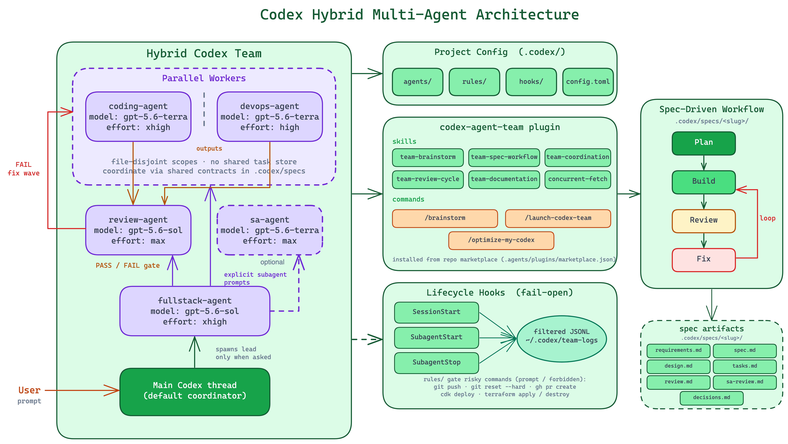

# Codex Agent Team Sample

A shareable sample configuration for a hybrid Codex development team. It combines project-scoped custom agents, a repo-local plugin, prompt shortcuts, lifecycle hooks, command rules, and spec templates for a plan-build-review workflow.

Jump to [Quick Start](#quick-start).

> This repository is a sample configuration, not a production-ready control plane. Review every agent instruction, hook, rule, plugin file, and security note before using it on real projects.

## Overview



The sample is built around a main-thread coordinator and five optional role agents:

| Agent | Role | Reasoning Effort | Primary Use |
| --- | --- | --- | --- |
| `fullstack-agent` | Spawned lead | xhigh | Specs, work splitting, delegation, and review-loop consolidation |
| `coding-agent` | Implementation engineer | high | Scoped production code, tests, refactors, and fixes |
| `devops-agent` | Infrastructure and delivery specialist | high | CI/CD, containers, IaC, environment wiring, and runbooks |
| `review-agent` | Independent reviewer | xhigh | PASS/FAIL review for bugs, regressions, security, and missing verification |
| `sa-agent` | Architecture and systems advisor | high | AWS-leaning architecture, reliability, cost, and operational design |

The reusable workflow lives in the `codex-agent-team` plugin under `plugins/codex-agent-team`. The custom agents live in `.codex/agents` because Codex custom agents are project or user configuration files rather than ordinary plugin contents. The sample also includes AWS security review guidance and project-scoped MCP server entries for AWS knowledge, AWS docs, AWS IaC help, Context7, and DeepWiki.

## Mental Model

Codex does not need a large team for every request. The default coordinator is still the main Codex thread. Use role agents when the work benefits from parallelism, role specialization, or a dedicated review gate.

The workflow has three practical rules:

1. Put durable planning artifacts in `.codex/specs/<slug>/`.
2. Split parallel work by files or ownership boundaries.
3. Treat review as a separate gate. A fix wave is not complete until an independent review reports PASS.

This sample does not provide a shared task database. Coordination happens through explicit prompts, repo-local spec files, and main-thread consolidation.

## Parallel Worker Pools

The installed team can run multiple instances of the same role when the work is genuinely file-disjoint. The public sample config sets `.codex/config.toml` to `max_threads = 14`, which leaves room for a spawned lead plus the largest intended first-level pool.

| Role | Maximum Parallel Instances | Naming Pattern | Use |
| --- | ---: | --- | --- |
| `coding-agent` | 6 | `coding-1` through `coding-6` | Product code, tests, refactors, and fixes split by file or module ownership |
| `devops-agent` | 2 | `devops-1`, `devops-2` | Independent CI/CD, infra, environment, container, or runbook scopes |
| `review-agent` | 4 | `review-1` through `review-4`, or scope names like `review-api` | Parallel review of separate modules, layers, or changed file sets |
| `sa-agent` | 1 | `sa-1` or a scope name | Architecture, reliability, cost, operations, and AWS design advice |

These are ceilings, not quotas. Use fewer agents when there are fewer independent scopes, and serialize any work that must touch the same files. Codex does not provide Claude-style shared task tools in this workflow, so the coordinator assigns each spawned instance an explicit name, file scope, expected output, and verification command.

The max-pool shape has been smoke-tested with six coding agents, two devops agents, four review agents, one SA agent, and a final lead consolidation pass. See [agent-pool-smoke-test.md](docs/agent-pool-smoke-test.md) for the result and operational notes.

## How The Workflow Runs

For non-trivial work, the flow is:

1. Capture requirements in `.codex/specs/<slug>/requirements.md` or create an initial `spec.md`.
2. Create or refine `spec.md`, `design.md`, and `tasks.md`.
3. Partition tasks into small, file-disjoint waves.
4. Spawn role agents only for slices that can proceed independently.
5. Give each spawned agent an explicit prompt with its role, spec path, file scope, expected output, and verification command.
6. Wait for all requested agents, then consolidate their results in the main thread or `fullstack-agent`.
7. Run a dedicated `review-agent` pass.
8. Convert any FAIL verdict into a fix wave, then review again.

Specs created during real work are ignored by `.gitignore`; they are runtime project artifacts, not part of this reusable sample.

## When To Use Each Agent

| Situation | Agent or Skill | Notes |
| --- | --- | --- |
| Starting from a rough idea | `team-brainstorm` | Produces `.codex/specs/<slug>/requirements.md` before deeper planning. |
| Planning a substantial feature | `fullstack-agent` with `team-spec-workflow` | Use when task splitting, artifacts, or review loops matter. |
| Implementing scoped app behavior | `coding-agent` | Give exact files, acceptance criteria, and verification commands. |
| Updating CI/CD, IaC, deployment config, or runbooks | `devops-agent` | Prefer plan, synth, diff, lint, dry-run, or non-mutating validation. |
| Reviewing a change | `review-agent` | Must lead with findings and return PASS or FAIL. |
| Evaluating architecture, reliability, cost, or operations | `sa-agent` | Useful before large build waves or production-impacting design choices. |
| Reviewing AWS resource security | `aws-security-guidelines` | Use for AWS IaC, deployment handoffs, data security controls, and production readiness. |
| Implementing many independent external calls | `concurrent-cached-fetch` | Adds bounded concurrency and content-keyed disk caching guidance. |

## Prerequisites

- Codex installed and authenticated.
- Python 3.8+ on `PATH`; hooks use only the Python standard library.
- A git repository root. Hook commands resolve repo-local paths with `git rev-parse --show-toplevel`.
- A trusted Codex project. Project `.codex` config, agents, hooks, and rules load only after you trust the project.
- Optional: organization approval for Codex, OpenAI usage, plugin distribution, hooks, and any future MCP/server integrations.

## Quick Start

1. Clone or copy this repository.

2. Open Codex from the repository root and mark the project trusted when prompted.

3. Register the repo marketplace:

```bash
codex plugin marketplace add /absolute/path/to/sample_codex_agent_team
```

4. Open `/plugins`, switch to the `Sample Codex Agent Team` marketplace, and install `Codex Agent Team`.

5. Start a new Codex thread so plugin skills, commands, and custom agents are discoverable.

6. Start with an explicit workflow prompt:

```text
Use the Codex hybrid team to plan this feature. Create a .codex/specs plan, split implementation into file-disjoint scopes, spawn role agents where useful, and run an independent review wave.
```

For a rough idea, use the brainstorm command or skill:

```text
Use $team-brainstorm for: <idea>
```

For an existing spec, use:

```text
Use $team-spec-workflow for .codex/specs/<slug>. Build the next file-disjoint wave, then run review.
```

## Common Usage Prompts

Create requirements from an idea:

```text
Use $team-brainstorm for a small internal dashboard that tracks service deployment health, owners, and stale alarms.
```

Plan a feature before coding:

```text
Use the Codex hybrid team for this feature. Create .codex/specs/deployment-health/, write spec.md, design.md, and tasks.md, then propose the first implementation wave before editing code.
```

Run parallel implementation:

```text
Use fullstack-agent as the coordinator. Split the work in .codex/specs/deployment-health/tasks.md into file-disjoint coding and devops scopes. Spawn up to 6 coding-agent instances and up to 2 devops-agent instances only where the files do not overlap, wait for all of them, and consolidate.
```

Run a focused review:

```text
Use review-agent to review the changes against .codex/specs/deployment-health/. If the changed files are separable, split review across up to 4 review-agent instances. Return Critical, Warning, Suggestion, Tests, and Verdict.
```

Request architecture advice:

```text
Use sa-agent to review the proposed design in .codex/specs/deployment-health/design.md for reliability, operational risk, cost, and security. Write findings to sa-review.md.
```

Audit your Codex setup:

```text
/optimize-my-codex
```

Scope the audit to one area:

```text
/optimize-my-codex agents
/optimize-my-codex hooks
/optimize-my-codex plugins
```

## Repository Layout

```text
.
|-- .agents/plugins/marketplace.json     # Repo marketplace exposing the plugin
|-- .codex/
|   |-- agents/                          # Custom Codex subagent roles
|   |-- config.toml                      # Shared subagent thread/depth defaults
|   |-- hooks.json                       # Repo-relative lifecycle hook wiring
|   |-- hooks/                           # Fail-open session/subagent loggers
|   `-- rules/                           # Command approval rules for risky operations
|-- plugins/codex-agent-team/
|   |-- .codex-plugin/plugin.json        # Plugin manifest
|   |-- commands/                        # Prompt shortcuts
|   `-- skills/                          # Team workflow skills
|-- docs/agent-pool-smoke-test.md        # Max-pool smoke-test result and lessons
|-- docs/design.md                       # Architecture and design notes for this sample
|-- docs/specs/templates/                # Starting templates for .codex/specs work
`-- SECURITY.md                          # Threat model and user responsibilities
```

## Key Concepts

### Agents

Agents are `.toml` files in `.codex/agents`. Each file defines a `name`, `description`, `model_reasoning_effort`, optional nickname candidates, and detailed developer instructions. The descriptions are important because they tell Codex when a role is appropriate.

The prompts intentionally constrain agents to their assigned scope:

- `fullstack-agent` coordinates and delegates; it should not default to large implementation work itself.
- `coding-agent` may run as `coding-1` through `coding-6`; each instance edits only its delegated files and reports when scope must expand.
- `devops-agent` may run as `devops-1` or `devops-2`; each instance prefers non-mutating validation and calls out deploy risk.
- `review-agent` may run as up to four reviewers; each instance reviews only its delegated scope, leads with findings, and returns PASS or FAIL.
- `sa-agent` gives design guidance and tradeoffs rather than routine code review.

### Plugin

The repo-local plugin lives at `plugins/codex-agent-team`. Its manifest points Codex at the `skills/` directory and exposes prompt shortcuts under `commands/`.

Install it from the repo marketplace when you want the reusable workflow in a Codex session. Keep the plugin small and reviewable: the plugin itself does not bundle executable MCP servers, app integrations, dependency installers, or network scripts. Project-scoped MCP server configuration lives separately in `.codex/config.toml`.

### Skills

Skills are reusable instructions that the main thread or agents load on demand.

| Skill | Purpose |
| --- | --- |
| `team-brainstorm` | Convert a rough idea into `.codex/specs/<slug>/requirements.md`. |
| `team-spec-workflow` | Drive spec artifacts, task waves, delegation, and review loops. |
| `team-coordination` | Write explicit subagent prompts with file boundaries and verification expectations. |
| `team-review-cycle` | Use scoped review files and PASS/FAIL verdicts. |
| `team-documentation` | Keep README, runbook, architecture, API, and spec docs aligned. |
| `aws-security-guidelines` | Review AWS services for encryption, TLS, logging, tagging, IAM, and production data controls. |
| `concurrent-cached-fetch` | Add bounded concurrency and disk caching for independent external fan-out calls. |

The AWS security guidance strengthens AWS-facing planning and review by making data controls explicit: KMS encryption, TLS enforcement, S3 Block Public Access, access logging, data-classification tags, least-privilege IAM, production-readiness checks, and `.codex/specs/<slug>/` security evidence for durable review notes.

### MCP Servers

Project-scoped MCP servers are configured in `.codex/config.toml`. They are available after the project is trusted and Codex reloads its MCP configuration. Review these entries before use because some servers start local `uvx` or `npx` processes and may download packages or access remote documentation services.

| Server | Transport | Purpose |
| --- | --- | --- |
| `aws-knowledge-mcp-server` | Streamable HTTP | AWS knowledge endpoint for AWS service and architecture context. |
| `awslabs_aws_documentation_mcp_server` | `uvx` stdio | AWS documentation lookup from the AWS Labs MCP server. |
| `awslabs_aws_iac_mcp_server` | `uvx` stdio | AWS infrastructure-as-code assistance, using `AWS_PROFILE=default`. |
| `context7` | `npx` stdio | Up-to-date library and framework documentation. |
| `deepwiki` | Streamable HTTP | Repository and documentation research through DeepWiki. |

### Commands

Prompt shortcuts live under `plugins/codex-agent-team/commands`.

| Command | Purpose |
| --- | --- |
| `/brainstorm` | Calls `team-brainstorm` to turn an idea into requirements. |
| `/launch-codex-team` | Starts the hybrid team workflow for a specified task or existing spec. |
| `/optimize-my-codex` | Audits `~/.codex` and `~/.agents` for stale config, unclear agents, hook/rule issues, skill/plugin drift, and missing current best practices. |

Commands are convenience wrappers. The same workflows can be invoked by naming the skills directly in a prompt.

Use `/optimize-my-codex` after Codex updates, model changes, plugin changes, or when a local setup feels slow, noisy, stale, or inconsistent. Pass an optional focus area such as `config`, `agents`, `hooks`, `rules`, `skills`, `plugins`, `marketplace`, or `commands` to limit the audit:

```text
/optimize-my-codex rules
```

The command must present findings first, grouped by impact, and wait for approval before editing any Codex setup files. When edits are approved, it makes minimal changes and validates changed JSON, TOML, or YAML where applicable.

### Specs

Runtime specs live under `.codex/specs/<slug>/`. The sample includes templates in `docs/specs/templates/`.

Common artifacts:

| File | Purpose |
| --- | --- |
| `requirements.md` | User problem, MVP scope, constraints, and open questions. |
| `spec.md` | Requirements, assumptions, interfaces, risks, and out-of-scope boundaries. |
| `design.md` | Architecture, components, data model, infrastructure, and tradeoffs. |
| `tasks.md` | File-disjoint waves with clear acceptance and verification. |
| `review.md` or `review-<scope>.md` | Independent findings and PASS/FAIL verdicts. |
| `review-summary.md` | Lead consolidation when review is split across scopes. |
| `sa-review.md` | Architecture and Well-Architected style findings. |
| `decisions.md` | Durable decision log. |

### Hooks

Hooks are configured in `.codex/hooks.json` and implemented in `.codex/hooks`.

| Event | Script | Purpose |
| --- | --- | --- |
| `SessionStart` | `.codex/hooks/session_start.py` | Records a filtered session-start event. |
| `SubagentStart` | `.codex/hooks/subagent_lifecycle.py start` | Records a filtered subagent-start event. |
| `SubagentStop` | `.codex/hooks/subagent_lifecycle.py stop` | Records a filtered subagent-stop event. |

The hooks are intentionally lightweight:

- They use only Python standard-library modules.
- They fail open so logging problems do not trap Codex.
- They filter incoming payloads to an allowlist.
- They write JSONL logs under `~/.codex/team-logs`.
- They rotate each log at 1 MiB with three backups.

Review and trust hooks with `/hooks` before relying on them. Disable them in stricter environments if local metadata logging is not acceptable.

### Rules

Rules in `.codex/rules/codex-agent-team.rules` keep selected high-risk commands explicit. They prompt or block operations such as:

- `git push`
- `git push --force` and `git push --force-with-lease`
- `git reset --hard`
- `git clean`
- `gh pr create`
- `cdk deploy` and `cdk destroy`
- `terraform apply` and `terraform destroy`

Rules reduce accidental risky operations. They do not replace sandboxing, code review, least-privilege credentials, or careful approval decisions.

## Writing Good Subagent Prompts

Subagent prompts should be concrete enough that the agent can finish without inventing scope.

Include:

- Role agent to use.
- Instance name when using a pool, such as `coding-3`, `devops-1`, or `review-api`.
- Spec path and task or wave reference.
- Exact file scope.
- Expected output artifact or summary.
- Verification command or concrete evidence expected.
- Instruction not to edit outside the listed scope.
- Reminder that peer instances may be editing nearby files concurrently.
- Whether the coordinator should wait for all agents before consolidating.

Example:

```text
Use coding-agent.
You are coding-3, one of up to 6 parallel coding instances.

Spec: .codex/specs/deployment-health/
Scope: implement the API response types in src/api/types.ts and tests in src/api/types.test.ts.
Do not edit files outside that scope. Other coding/devops instances may be running concurrently; do not overwrite their work.

Acceptance:
- Exports match the contract in spec.md.
- Invalid state names are rejected.
- Existing callers keep compiling.

Verify:
- npm test -- src/api/types.test.ts
- npm run typecheck

Return:
- Summary of changes
- Commands run and outcomes
- Any required scope expansion
```

## Operating Safely

Use this sample with normal production safeguards:

- Treat unknown accounts, stages, clusters, and workspaces as production.
- Prefer read-only, list, describe, get, plan, synth, diff, and dry-run operations before mutating commands.
- Do not inline secrets in prompts, code, docs, config, tests, or command examples.
- Keep runtime specs, logs, local state, `.env` files, and provider credentials out of git.
- Use least-privilege credentials for investigation.
- Require explicit user direction and an impact statement before destructive operations.
- For ops smoke tests, require a disposable or non-production target, bounded retries and timeouts, abort criteria, and evidence capture before any external endpoint checks.

## Troubleshooting

If a subagent fails before doing work with an engine routing error such as `404 Not Found: Engine not found`, close that failed agent and retry the same bounded scope. If retries keep failing for the inherited model, retry with a supported explicit model override and record the operational note in the relevant spec or review artifact.

## Customization

- Add or edit custom agents in `.codex/agents/*.toml`.
- Add workflow skills under `plugins/codex-agent-team/skills/<skill>/SKILL.md`.
- Add prompt shortcuts under `plugins/codex-agent-team/commands/`.
- Add more marketplace entries in `.agents/plugins/marketplace.json`.
- Adjust subagent concurrency and recursion defaults in `.codex/config.toml`.
- Keep machine-specific provider settings, secrets, model providers, local paths, installed plugin caches, and runtime artifacts out of this repo.

When adding a new role agent, update:

1. `.codex/agents/<name>.toml`
2. This README's role tables
3. `docs/design.md`
4. Relevant skills or prompt shortcuts
5. `SECURITY_REVIEW.md` if the new agent changes trust boundaries, execution surface, or data handling

## Validation

Useful checks after editing:

```bash
python3 -m py_compile .codex/hooks/session_start.py .codex/hooks/subagent_lifecycle.py
python3 -m json.tool .codex/hooks.json
python3 -m json.tool .agents/plugins/marketplace.json
python3 -m json.tool plugins/codex-agent-team/.codex-plugin/plugin.json
python3 -c "import pathlib, tomllib; files=[pathlib.Path('.codex/config.toml'), *pathlib.Path('.codex/agents').glob('*.toml')]; [tomllib.loads(p.read_text()) for p in files]"
ruby -e 'require "yaml"; ARGV.each { |f| YAML.load_file(f) }; puts "yaml ok"' plugins/codex-agent-team/skills/*/agents/openai.yaml
```

For plugin manifest validation, use Codex's bundled `plugin-creator` validator if available:

```bash
python3 ~/.codex/skills/.system/plugin-creator/scripts/validate_plugin.py plugins/codex-agent-team
```

To check that Codex can load the project prompt/config context:

```bash
codex debug prompt-input "validate repo config"
```

If this command fails under a strict sandbox, rerun it in a normal shell or through your approved local Codex execution path.

## Troubleshooting

| Symptom | Likely Cause | Fix |
| --- | --- | --- |
| Skills or commands are not visible | Session started before plugin install or enablement | Restart the Codex thread after installing the plugin. |
| Custom agents are missing | Project is not trusted or Codex was not opened at repo root | Trust the project and restart from the repository root. |
| Hooks do not run | Hooks are not trusted, project is not a git repo, or hook path resolution failed | Review `/hooks`, ensure the repo has a git root, and inspect `.codex/hooks.json`. |
| Subagents edit overlapping files | Task scopes were not file-disjoint | Stop the wave, reconcile changes in the main thread, then create narrower tasks. |
| Review keeps failing | Findings are real or acceptance criteria are ambiguous | Convert findings into a fix wave and clarify the spec before more edits. |
| Plugin validation fails | Manifest schema or path issue | Check `plugins/codex-agent-team/.codex-plugin/plugin.json` and rerun the validator. |

## Legal And Security Review

Before adopting this sample for organization use, complete your own approvals:

| Area | Status |
| --- | --- |
| Codex/OpenAI usage approval | To be completed by adopter |
| Plugin distribution approval | To be completed by adopter |
| Hook execution review | To be completed by adopter |
| Local metadata logging approval | To be completed by adopter |
| MCP/server integrations | Review project-scoped entries in `.codex/config.toml` before trusting or enabling |
| Production or cloud-resource access | To be completed by adopter |

See `SECURITY.md` for the threat model.

## License

This sample is licensed under the MIT-0 License. See `LICENSE`.
